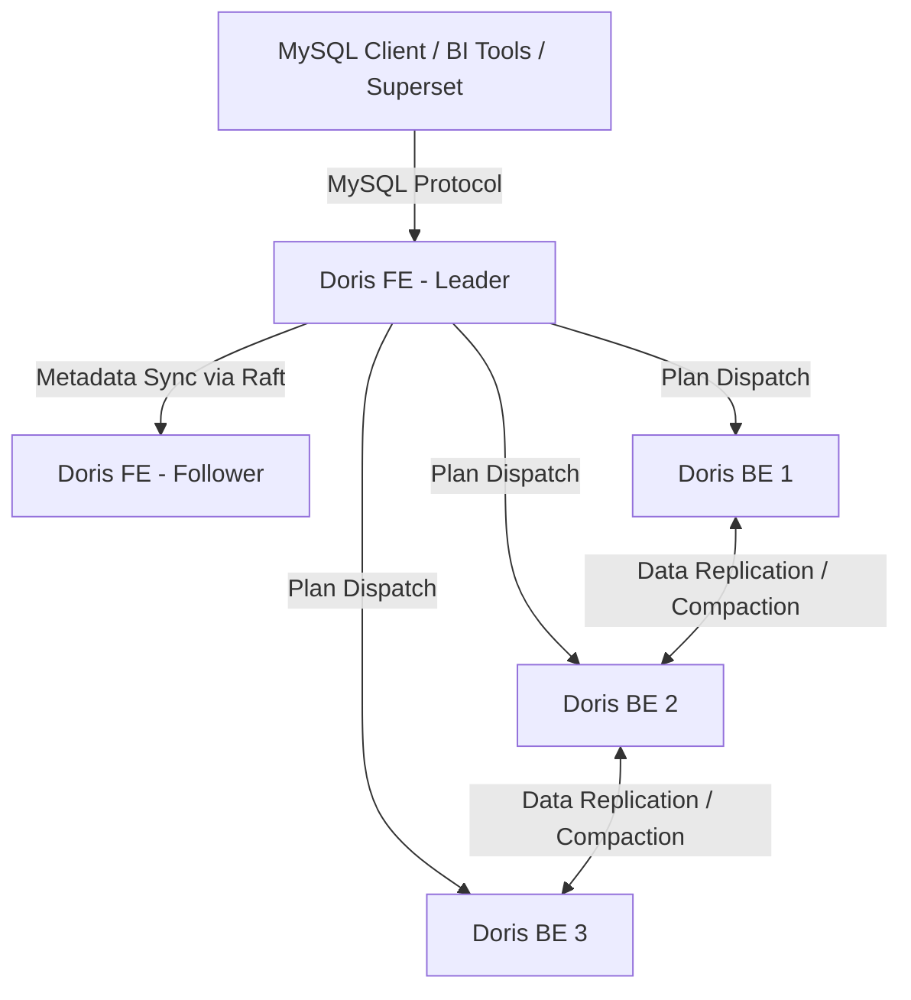

# BÁO CÁO KỸ THUẬT: XÂY DỰNG NỀN TẢNG ODS THỜI GIAN THỰC PHỤC VỤ PHÂN TÍCH DỮ LIỆU LỚN
## CHƯƠNG TRÌNH VIETTEL DIGITAL TALENT 2026 - PROJECT 37

* **Đơn vị đào tạo:** Viettel Digital Talent (VDT)
* **Đề tài:** Project 37: Xây dựng nền tảng ODS thời gian thực phục vụ phân tích dữ liệu lớn
* **GitHub Repository:** [dducsw/vdt-project](https://github.com/dducsw/vdt-project)
* **Mentor:** Nguyễn Ngọc Long - VTS (longnn23@viettel.com.vn)
* **Mentee:** Lê Đình Đức - VDT (ledinhduc1879@gmail.com)

---

## MỤC LỤC

- [BÁO CÁO KỸ THUẬT: XÂY DỰNG NỀN TẢNG ODS THỜI GIAN THỰC PHỤC VỤ PHÂN TÍCH DỮ LIỆU LỚN](#báo-cáo-kỹ-thuật-xây-dựng-nền-tảng-ods-thời-gian-thực-phục-vụ-phân-tích-dữ-liệu-lớn)
  - [CHƯƠNG TRÌNH VIETTEL DIGITAL TALENT 2026 - PROJECT 37](#chương-trình-viettel-digital-talent-2026---project-37)
  - [MỤC LỤC](#mục-lục)
  - [PHẦN I: TỔNG QUAN BÀI TOÁN \& YÊU CẦU THIẾT KẾ](#phần-i-tổng-quan-bài-toán--yêu-cầu-thiết-kế)
    - [1. Đặt vấn đề](#1-đặt-vấn-đề)
    - [2. Vai trò vận hành của ODS thời gian thực](#2-vai-trò-vận-hành-của-ods-thời-gian-thực)
    - [3. So sánh ODS, Data Warehouse, Data Lake và Data Lakehouse](#3-so-sánh-ods-data-warehouse-data-lake-và-data-lakehouse)
  - [PHẦN II: KIẾN TRÚC HỆ THỐNG VÀ LUỒNG DỮ LIỆU](#phần-ii-kiến-trúc-hệ-thống-và-luồng-dữ-liệu)
    - [1. Sơ đồ kiến trúc tổng thể](#1-sơ-đồ-kiến-trúc-tổng-thể)
    - [2. Các thành phần chính trong Pipeline](#2-các-thành-phần-chính-trong-pipeline)
      - [2.1. CDC (Change Data Capture) Ingestion Pipeline](#21-cdc-change-data-capture-ingestion-pipeline)
      - [2.2. Clickstream Processing Pipeline](#22-clickstream-processing-pipeline)
      - [2.3. Sự cải tiến kiến trúc: Chuyển CDC từ Spark Streaming sang Native Doris Routine Load](#23-sự-cải-tiến-kiến-trúc-chuyển-cdc-từ-spark-streaming-sang-native-doris-routine-load)
  - [PHẦN III: CÔNG NGHỆ LƯU TRỮ VÀ PHÂN TÍCH APACHE DORIS](#phần-iii-công-nghệ-lưu-trữ-và-phân-tích-apache-doris)
    - [1. Tổng quan công nghệ Apache Doris](#1-tổng-quan-công-nghệ-apache-doris)
    - [2. Kiến trúc phân tán FE và BE](#2-kiến-trúc-phân-tán-fe-và-be)
    - [3. Mô hình lưu trữ dữ liệu (Storage Data Models)](#3-mô-hình-lưu-trữ-dữ-liệu-storage-data-models)
    - [4. Cơ chế tối ưu hóa truy vấn](#4-cơ-chế-tối-ưu-hóa-truy-vấn)
  - [PHẦN IV: THIẾT KẾ SCHEMA, DATA MODELING \& DWS VIEWS](#phần-iv-thiết-kế-schema-data-modeling--dws-views)
    - [1. Thiết kế Schema bảng vật lý (DDL)](#1-thiết-kế-schema-bảng-vật-lý-ddl)
    - [2. Xây dựng các View phân tích (DWS Layer)](#2-xây-dựng-các-view-phân-tích-dws-layer)
    - [3. Trực quan hóa dữ liệu (Apache Superset)](#3-trực-quan-hóa-dữ-liệu-apache-superset)
  - [PHẦN V: KẾT QUẢ THỰC NGHIỆM VÀ BENCHMARK](#phần-v-kết-quả-thực-nghiệm-và-benchmark)
    - [1. Cấu hình môi trường thử nghiệm](#1-cấu-hình-môi-trường-thử-nghiệm)
    - [2. Quy mô dữ liệu hiện tại \& Thông lượng nạp (Ingestion Throughput)](#2-quy-mô-dữ-liệu-hiện-tại--thông-lượng-nạp-ingestion-throughput)
    - [3. Query Latency Benchmark trên Apache Doris](#3-query-latency-benchmark-trên-apache-doris)
    - [4. Đánh giá tối ưu hóa tài nguyên phần cứng](#4-đánh-giá-tối-ưu-hóa-tài-nguyên-phần-cứng)
    - [5. Nguồn gốc số liệu và Phương pháp đo lường (Metrics Source)](#5-nguồn-gốc-số-liệu-và-phương-pháp-đo-lường-metrics-source)
    - [6. Giám sát hệ thống thời gian thực (Grafana \& Prometheus)](#6-giám-sát-hệ-thống-thời-gian-thực-grafana--prometheus)
  - [PHẦN VI: SO SÁNH CÔNG NGHỆ \& PHẢN HỒI CÂU HỎI MENTOR](#phần-vi-so-sánh-công-nghệ--phản-hồi-câu-hỏi-mentor)
    - [1. Tại sao dùng ODS mà không dùng trực tiếp DWH hay Lakehouse?](#1-tại-sao-dùng-ods-mà-không-dùng-trực-tiếp-dwh-hay-lakehouse)
    - [2. Tại sao Clickstream Events gửi trực tiếp vào Kafka thay vị qua Apache NiFi?](#2-tại-sao-clickstream-events-gửi-trực-tiếp-vào-kafka-thay-vị-qua-apache-nifi)
    - [3. So sánh StarRocks vs Apache Doris](#3-so-sánh-starrocks-vs-apache-doris)
    - [4. So sánh Spark Structured Streaming vs Apache Flink](#4-so-sánh-spark-structured-streaming-vs-apache-flink)
  - [PHẦN VII: KẾT LUẬN VÀ HƯỚNG PHÁT TRIỂN](#phần-vii-kết-luận-và-hướng-phát-triển)

---

## PHẦN I: TỔNG QUAN BÀI TOÁN & YÊU CẦU THIẾT KẾ

### 1. Đặt vấn đề
Trong các hệ thống phân tích dữ liệu hiện đại của doanh nghiệp (tài chính, viễn thông, thương mại điện tử, IoT, v.v.), nhu cầu xử lý và phân tích dữ liệu gần thời gian thực (near real-time analytics) đóng vai trò quyết định đến hiệu quả kinh doanh và khả năng ứng biến vận hành. Các hệ thống Batch truyền thống hoạt động theo chu kỳ lớn (hàng ngày hoặc hàng giờ) tạo ra một khoảng trống thông tin lớn, khiến doanh nghiệp không thể phản ứng kịp thời với các sự kiện khẩn cấp như phát hiện gian lận tài chính, biến động thị trường hoặc phân tích hành vi người dùng tức thì.

Dự án này tập trung giải quyết bài toán phân tích luồng dữ liệu tương tác người dùng dạng **Clickstream** và luồng thay đổi trạng thái dữ liệu nghiệp vụ giao dịch **eCommerce (TheLook eCommerce)**. Dữ liệu nghiệp vụ được kế thừa từ tập dữ liệu gốc [TheLook eCommerce (Kaggle Looker Ecommerce BigQuery Dataset)](https://www.kaggle.com/datasets/mustafakeser4/looker-ecommerce-bigquery-dataset), bao gồm các thông tin giao dịch có cấu trúc biến đổi liên tục lưu tại database nguồn PostgreSQL cùng lượng lớn sự kiện clickstream sinh ra từ hành vi lướt web của khách hàng.

### 2. Vai trò vận hành của ODS thời gian thực
Hệ thống **Operational Data Store (ODS)** đóng vai trò là tầng lưu trữ, đồng bộ và phân tích dữ liệu trung gian, nằm giữa các cơ sở dữ liệu giao dịch trực tuyến (OLTP) và Kho dữ liệu lịch sử (Data Warehouse). ODS thời gian thực giải quyết 3 thách thức cốt lõi:
1. **Giảm tải trực tiếp cho các OLTP DB nguồn**: Ngăn chặn tình trạng các câu lệnh truy vấn phân tích (OLAP) phức tạp, quét dữ liệu lớn làm nghẽn hoặc sập cơ sở dữ liệu phục vụ giao dịch trực tiếp của khách hàng.
2. **Hợp nhất dữ liệu đa nguồn**: Kết hợp dữ liệu giao dịch nghiệp vụ (Products, Users, Orders) với dữ liệu clickstream phi cấu trúc/bán cấu trúc có tần suất cực lớn để tạo ra một nguồn dữ liệu sạch, nhất quán ngay tại thời điểm ghi nhận.
3. **Độ trễ thấp vượt trội**: Cung cấp dữ liệu tích hợp sẵn sàng cho các dashboard giám sát vận hành tức thời và ứng dụng ra quyết định chiến thuật với độ trễ ở mức giây hoặc dưới giây.

### 3. So sánh ODS, Data Warehouse, Data Lake và Data Lakehouse

| Đặc tính kỹ thuật | Operational Data Store (ODS) | Data Warehouse (DWH) | Data Lake | Data Lakehouse |
| :--- | :--- | :--- | :--- | :--- |
| **Mục đích chính** | Báo cáo vận hành thời gian thực, ra quyết định tức thời mang tính chiến thuật. | Phân tích lịch sử sâu, báo cáo BI doanh nghiệp, định hình xu hướng chiến lược. | Lưu trữ dữ liệu thô, phân tích khám phá, nghiên cứu học máy. | Hợp nhất phân tích hiệu năng cao và lưu trữ dữ liệu thô linh hoạt trên cùng một nền tảng. |
| **Cấu trúc dữ liệu** | Dữ liệu cấu trúc, chuẩn hóa cơ bản từ nguồn, duy trì dạng chi tiết. | Dữ liệu cấu trúc, được mô hình hóa chặt chẽ (Schema-on-write, Star/Snowflake Schema). | Dữ liệu thô đa dạng bao gồm cấu trúc, bán cấu trúc (JSON, XML), phi cấu trúc. | Đa định dạng dữ liệu thô và dữ liệu đã chuyển đổi, hỗ trợ thực thi schema. |
| **Phạm vi thời gian** | Dữ liệu hiện tại, tức thời, có vòng đời lưu trữ ngắn, ít lưu lịch sử sâu. | Lịch sử lâu dài tích lũy qua nhiều năm, phục vụ đối chiếu dài hạn. | Lưu trữ cả dữ liệu hiện tại và toàn bộ lịch sử thô từ lúc bắt đầu hệ thống. | Lưu trữ lịch sử lâu dài kèm giao dịch ACID và quản lý phiên bản dữ liệu (Time Travel). |
| **Kiến trúc lưu trữ** | Cơ sở dữ liệu quan hệ hiệu năng cao hoặc các công nghệ Realtime OLAP phân tán. | Cơ sở dữ liệu OLAP chuyên dụng hoặc cơ sở dữ liệu xử lý song song khối lượng lớn (MPP). | Hệ thống tệp phân tán (HDFS) hoặc lưu trữ đối tượng đám mây (Object Storage) giá rẻ. | Object Storage kết hợp tầng siêu dữ liệu (Metadata Layer như Delta Lake, Iceberg). |
| **Phương thức nạp** | CDC thời gian thực, nạp dữ liệu liên tục theo dòng (Streaming Ingestion). | Quy trình ETL theo lô (Batch Processing) định kỳ hàng giờ hoặc hàng ngày. | Quy trình ELT nạp trực tiếp dữ liệu thô với độ trễ tối thiểu. | Hỗ trợ song song cả quy trình nạp theo lô (Batch) và nạp dạng dòng (Streaming). |

---

## PHẦN II: KIẾN TRÚC HỆ THỐNG VÀ LUỒNG DỮ LIỆU

### 1. Sơ đồ kiến trúc tổng thể
Hệ thống được thiết kế tối ưu với hai tuyến ingest bổ trợ nhau nhằm đạt hiệu năng ghi nhận tối đa và giảm thiểu tài nguyên tiêu thụ:

```
                                  +-------------------+
                                  | PostgreSQL Source |
                                  +---------+---------+
                                            | (Debezium CDC)
                                            v
+------------------+              +---------+---------+
| Datagen Producer |              |   Kafka Broker    |
+--------+---------+              +----+--------+-----+
         | (Clickstream Events)        |        |
         v                             |        | (dim/fact topics)
+--------+---------+                   |        v
|   Kafka Broker   |                   |  +-----+-------------------------+
+--------+---------+                   |  | Doris Native Routine Load    |
         |                             |  | (Direct SQL ingestion)        |
         v                             |  +-----+-------------------------+
+--------+---------+                   |        |
| PySpark Stream   |<------------------+        | (Change Propagation)
| (JDBC lookup)    |                            v
+--------+---------+                   +--------+-------------------------+
         | (Enriched CSV Load)         |       Apache Doris OLAP         |
         v                             |   (Unique Key / Duplicate Key)   |
+--------+-------------------------+   +----------------------------------+
| Doris Table: dwd_clickstream     |
+----------------------------------+
```

### 2. Các thành phần chính trong Pipeline

#### 2.1. CDC (Change Data Capture) Ingestion Pipeline
Bắt kịp thời các thay đổi dữ liệu nghiệp vụ từ PostgreSQL để đồng bộ sang ODS nhằm thực hiện các câu truy vấn JOIN phân tích tức thời.
* **Cơ sở dữ liệu giao dịch nguồn (OLTP)**: PostgreSQL (`thelook_db`) lưu trữ các bảng nghiệp vụ: `users`, `products`, `orders`, `order_items`, `distribution_centers`, `inventory_items` được kế thừa cấu trúc từ tập dữ liệu [TheLook eCommerce (Kaggle Looker Ecommerce BigQuery Dataset)](https://www.kaggle.com/datasets/mustafakeser4/looker-ecommerce-bigquery-dataset). Do đây là nguồn dữ liệu có cấu trúc, được kiểm soát chặt chẽ bởi các ràng buộc giao dịch và khóa ngoại của hệ thống OLTP nên thông tin có độ tin cậy, chính xác cao và ít xảy ra sai sót.
* **CDC Component**: **Debezium** thực hiện giám sát liên tục Write-Ahead Log (WAL) của PostgreSQL. Mọi hành động ghi dữ liệu (`INSERT`), cập nhật (`UPDATE`), hoặc xóa (`DELETE`) đều được Debezium trích xuất bất đồng bộ dưới dạng sự kiện CDC và chuyển tiếp vào các topic tương ứng trên Apache Kafka.
* **Ingestion Engine**: Dữ liệu từ các Kafka CDC topics được nạp trực tiếp vào Apache Doris thông qua cơ chế **Doris Native Routine Load** (sẽ trình bày chi tiết ở mục 2.3).

#### 2.2. Clickstream Processing Pipeline
Giả lập và xử lý dòng hành vi người dùng trực tuyến thời gian thực với thông lượng cực kỳ lớn.
* **Datagen Producer**: Một chương trình Python (sử dụng thư viện `confluent-kafka` và `Faker`) sinh liên tục các sự kiện clickstream (hành động xem trang chủ, xem sản phẩm, thêm vào giỏ hàng, đặt hàng, hủy đơn, trả hàng) để gửi bất đồng bộ vào topic `clickstream-events` của Kafka. Ở đây, Datagen đóng vai trò như một API Gateway/Collector Service giả lập. Trong thực tế sản xuất, các thiết bị client đầu cuối (Web/Mobile) sẽ gửi dữ liệu thông qua giao thức HTTPS đến một tầng Gateway (như REST Proxy hoặc Backend-For-Frontend) để đảm bảo bảo mật và phân quyền thay vì kết nối TCP trực tiếp tới các broker Kafka.
* **Stream Processing Engine**: **PySpark Structured Streaming (Spark 3.5.6)** tiêu thụ luồng sự kiện từ Kafka theo các micro-batches (kích thước chu kỳ kích hoạt 5 giây).
* **Quy trình xử lý trên Spark**:
  1. **Parse & Validate**: Giải mã dữ liệu JSON thô và thực hiện lọc các bản ghi không hợp lệ hoặc lỗi định dạng. Các bản ghi lỗi được tách riêng và đẩy xuống bảng `ods_clickstream_deadletter` (Deadletter queue) trong Doris để phục vụ giám sát chất lượng dữ liệu.
  2. **Watermarking & Deduplication**: Cấu hình cơ chế Watermark (độ trễ tối đa cho phép 10 phút) dựa trên thời gian phát sinh sự kiện (`event_timestamp`). Thực hiện loại bỏ trùng lặp sự kiện (Deduplication) dựa trên cặp khóa duy nhất `(id, event_timestamp)` để đảm bảo tính chính xác trong việc xử lý đúng một lần (exactly-once processing).
  3. **URI Extraction**: Thực hiện phân tách chuỗi đường dẫn URI của trang web người dùng tương tác để bóc tách thông tin loại trang (`page_type`) và định danh sản phẩm (`product_id`) nhằm tối ưu hóa việc phân tích hành vi.
  4. **Bulk Stream Load**: Các dữ liệu clickstream đã được chuẩn hóa được Spark stream trực tiếp vào bảng `dwd_clickstream_events` của Apache Doris dưới định dạng Stream Load hiệu năng cao.
  * **Triết lý thiết kế Transform**: Hệ thống không lạm dụng biến đổi dữ liệu sâu trên Spark mà chuyển sang cơ chế **Transform-on-Query** tận dụng sức mạng tính toán song song MPP & Vectorized Engine của Doris. Điều này giúp giữ cho pipeline ghi nhận dữ liệu (ingestion pipeline) luôn có độ trễ cực thấp (sub-second) và dễ dàng mở rộng.

#### 2.3. Sự cải tiến kiến trúc: Chuyển CDC từ Spark Streaming sang Native Doris Routine Load
Trong thiết kế ban đầu, luồng CDC dữ liệu nghiệp vụ cũng được định hướng đi qua Spark Structured Streaming để thực hiện parsing JSON và ghi vào Doris. Tuy nhiên, sau quá trình phân tích kỹ thuật, chúng tôi đã chuyển dịch hoàn toàn luồng CDC sang **Native Doris Routine Load**:
* **Cơ chế hoạt động**: Apache Doris tích hợp sẵn các công cụ kết nối trực tiếp đến Kafka Broker. Bằng các câu lệnh SQL khởi tạo `CREATE ROUTINE LOAD`, các node Frontend (FE) của Doris tự động lập lịch điều phối và các Backend (BE) sẽ trực tiếp tiêu thụ các bản tin JSON CDC từ Kafka, giải mã cấu trúc dựa trên đường dẫn `jsonpaths` được định nghĩa trước và ghi trực tiếp vào các bảng Unique Key.
* **Giải quyết delete propagation**: Đối với các hành động xóa (`DELETE`) từ PostgreSQL, Debezium phát bản tin CDC có trường payload operation `op = 'd'` và trường `before` chứa dữ liệu trước khi xóa. Routine Load sử dụng hàm `coalesce` để lấy `id = coalesce(payload.after.id, payload.before.id)` và đặt giá trị của cột ẩn của Doris `__DORIS_DELETE_SIGN__ = case when op = 'd' then 1 else 0 end`. Cơ chế Unique Key của Doris sẽ tự động đánh dấu xóa bản ghi có ID tương ứng khi nhận được giá trị 1.
* **Lợi ích thực tế**: 
  - Loại bỏ hoàn toàn overhead khởi tạo JVM và tài nguyên tính toán của cụm Spark khi xử lý các luồng dữ liệu transaction nghiệp vụ có kích thước bản ghi nhỏ nhưng yêu cầu độ trễ ghi tức thì.
  - Rút ngắn chặng di chuyển của dữ liệu từ Kafka đến đĩa lưu trữ của Doris, loại bỏ bước trung gian serialize/deserialize dữ liệu trên Spark Driver.

---

## PHẦN III: CÔNG NGHỆ LƯU TRỮ VÀ PHÂN TÍCH APACHE DORIS

### 1. Tổng quan công nghệ Apache Doris
Apache Doris là một hệ quản trị cơ sở dữ liệu phân tích thời gian thực (Real-time OLAP Database) MPP (Massively Parallel Processing), được phát triển chủ yếu bằng C++ cho tầng Backend và Java cho tầng Frontend. Hệ thống được tối ưu hóa cho các truy vấn phân tích tương tác trên tập dữ liệu quy mô lớn với các ưu thế kỹ thuật nổi bật:
* **Vectorized Execution Engine**: Thực thi tính toán theo khối (Chunk-oriented) thay vì dòng đơn lẻ, khai thác tối đa sức mạnh của tập lệnh xử lý song song SIMD trên CPU hiện đại, giúp giảm chi phí gọi hàm và tối đa hóa băng thông bộ nhớ RAM.
* **Vectorized Query Optimizer (CBO)**: Bộ tối ưu hóa truy vấn dựa trên chi phí tính toán kết hợp với luật logic để lập ra kế hoạch thực thi tối ưu nhất trước khi phân tán đến các BE nodes.
* **Giao thức MySQL chuẩn**: Khách hàng kết nối đến Doris thông qua giao thức MySQL truyền thống, tương thích tự nhiên với tất cả các thư viện ứng dụng và công cụ trực quan hóa (BI) như Apache Superset hay Tableau.

### 2. Kiến trúc phân tán FE và BE
Kiến trúc Doris cực kỳ tối giản, không phụ thuộc vào các dịch vụ quản lý cấu hình bên thứ ba như Apache ZooKeeper:



* **Frontend (FE)**:
  - **Nhiệm vụ**: Quản lý kết nối người dùng, lưu trữ siêu dữ liệu (metadata), phân tích biên dịch câu lệnh SQL và lập lịch điều phối các Task vật lý.
  - **Cơ chế đồng thuận (Metadata Consensus)**: Siêu dữ liệu được lưu trữ trong RAM của FE và ghi nhận vào Write-Ahead Log. Cơ chế đồng thuận giữa các FE Follower được duy trì thông qua giao thức Raft sửa đổi. FE Leader đóng vai trò ghi nhận duy nhất và đồng bộ tới Follower/Observer.
* **Backend (BE)**:
  - **Nhiệm vụ**: Thực thi tính toán truy vấn cục bộ và lưu trữ dữ liệu vật lý.
  - **C++ Native**: Toàn bộ logic của BE được lập trình bằng C++ để loại bỏ chi phí dọn rác (Garbage Collection) của JVM, cho phép quản lý bộ nhớ đệm chủ động và tối đa hiệu năng CPU.

### 3. Mô hình lưu trữ dữ liệu (Storage Data Models)
Doris hỗ trợ 3 mô hình lưu trữ tối ưu hóa cho từng cấu trúc nghiệp vụ của ODS:
1. **Duplicate Key Model (Mô hình khóa trùng lặp)**:
   - *Đặc tính*: Lưu trữ nguyên vẹn dữ liệu nạp vào, cho phép trùng lặp hoàn toàn các cột khóa.
   - *Ứng dụng*: Bảng chi tiết sự kiện clickstream (`dwd_clickstream_events`). Mô hình này đem lại thông lượng nạp dữ liệu (Write Throughput) cao nhất do không mất chi phí đối chiếu khóa.
2. **Unique Key Model (Mô hình khóa duy nhất)**:
   - *Đặc tính*: Hoạt động theo cơ chế cập nhật khóa (`UPSERT`). Nếu bản ghi nạp vào trùng khóa chính, bản ghi mới sẽ thay thế bản ghi cũ.
   - *Ứng dụng*: Các bảng chiều nghiệp vụ và bảng Fact transaction cần đồng bộ CDC (`dim_users`, `dim_products`, `fact_orders`, v.v.).
   - *Cơ chế Merge-on-Write (MoR vs WoW)*: Dự án áp dụng cơ chế **Write-on-Write** (từ Doris 2.0+). Khi ghi đè, hệ thống đánh dấu bản ghi cũ lỗi thời trong file segment cũ thông qua Delete Bitmap. Khi đọc, Doris chỉ việc quét trực tiếp các bản ghi hợp lệ mà không cần gộp (merge) dữ liệu tại thời điểm đọc, cải thiện tốc độ truy vấn từ 3 đến 10 lần.
3. **Aggregate Key Model (Mô hình tích lũy dữ liệu)**:
   - *Đặc tính*: Tự động gộp các bản ghi trùng cột khóa dựa trên hàm tích lũy (`SUM`, `MIN`, `MAX`, `REPLACE`, `BITMAP_UNION`) ngay lúc ghi nhận dữ liệu hoặc trong tiến trình chạy nén ngầm (Compaction).

### 4. Cơ chế tối ưu hóa truy vấn
* **Phân vùng Range & Phân cụm Hash**: Dữ liệu được phân chia Range theo cột thời gian (ví dụ: ngày `event_date`) để tối ưu hóa việc loại bỏ phân vùng không liên quan khi truy vấn (Partition Pruning). Trong mỗi phân vùng, dữ liệu tiếp tục được băm (Hash Bucketing) theo cột khóa (ví dụ: `session_id`) tạo thành các **Tablet** vật lý độc lập phục vụ lưu trữ phân tán.
* **Chỉ mục phụ đa dạng (Secondary Indexes)**:
  - **Prefix Index**: Tự động tạo chỉ mục thưa trên tiền tố các cột khóa (Short Key) giúp tìm kiếm nhị phân nhanh các khối dữ liệu mục tiêu.
  - **Inverted Index**: Cấu trúc chỉ mục đảo hỗ trợ các phép lọc `=`, `!=`, `IN` và tìm kiếm chuỗi văn bản nâng cao (`MATCH`) cực nhanh trên các cột không thuộc khóa chính.
  - **Bloom Filter**: Chỉ mục xác suất thiết lập trên các cột có độ phân tán lớn (ví dụ: `session_id`, `user_id`) để bỏ qua nhanh các khối dữ liệu không chứa giá trị tìm kiếm mà không cần tốn I/O đọc đĩa.
* **Colocate Join**: Đồng bộ vị trí lưu trữ vật lý của các Tablet thuộc hai bảng lớn có cùng cấu hình phân cụm băm trên các BE node. Phép JOIN sau đó diễn ra cục bộ tại BE (Local Join), triệt tiêu hoàn toàn chi phí truyền dữ liệu qua mạng (Network Data Shuffle).

---

## PHẦN IV: THIẾT KẾ SCHEMA, DATA MODELING & DWS VIEWS

### 1. Thiết kế Schema bảng vật lý (DDL)
Toàn bộ cấu trúc bảng vật lý được triển khai trong cơ sở dữ liệu `thelook_dw` (chi tiết xem tại [ddl.sql](file:///d:/Projects/vdt-project/src/doris/ddl.sql)).

### 2. Xây dựng các View phân tích (DWS Layer)
Để tối ưu hóa hiệu năng truy vấn cho Dashboard mà không làm phức tạp hóa pipeline xử lý thời gian thực, toàn bộ các logic tổng hợp nâng cao được triển khai dưới dạng các **Views phân tích (DWS Views)** trong Doris, tận dụng khả năng tính toán song song mạnh mẽ của BE (chi tiết xem tại [views.sql](file:///d:/Projects/vdt-project/src/doris/views.sql)):
1. **`dws_clickstream_window_agg`**: Tổng hợp dữ liệu clickstream theo các cửa sổ thời gian 5 phút.
2. **`dws_clickstream_sessions`**: Phân tích sâu hành vi và sở thích theo từng phiên truy cập (`session_id`).
3. **`dws_sales_performance_flat`**: Một Flat View liên kết dữ liệu giao dịch chi tiết với các bảng chiều phục vụ phân tích đa chiều.
4. **`dws_sales_overview_hourly`**: Tự động tổng hợp dữ liệu doanh số theo giờ.
5. **`dws_product_performance`**: Đánh giá hiệu suất sản phẩm kết hợp bán hàng và tương tác clickstream.
6. **`dws_inventory_details`**: Chi tiết trạng thái tồn kho và phân tích số ngày cần thiết để bán một mặt hàng.

### 3. Trực quan hóa dữ liệu (Apache Superset)
Hệ thống kết nối trực tiếp Apache Superset vào Apache Doris Frontend (FE) để truy xuất dữ liệu từ các DWS Views và hiển thị lên Dashboard với độ trễ thấp.


---

## PHẦN V: KẾT QUẢ THỰC NGHIỆM VÀ BENCHMARK

### 1. Cấu hình môi trường thử nghiệm
Các thử nghiệm thực nghiệm được thực thi hoàn toàn trong môi trường Docker giả lập, áp dụng giới hạn cứng tài nguyên hệ thống (Hard Resource Limits) đối với các container để đánh giá khả năng chịu tải của hệ thống trong điều kiện tài nguyên tối thiểu:
* **Spark Worker**: 2 Cores CPU, 2 GB RAM.
* **Apache Doris BE**: 2 Cores CPU, 2 GB RAM.
* **Apache Doris FE**: 1 Core CPU, 1.5 GB RAM.
* **Kafka Broker & Debezium**: 1 Core CPU, 1.5 GB RAM (chung cấu hình vật lý).

### 2. Quy mô dữ liệu hiện tại & Thông lượng nạp (Ingestion Throughput)
Tính đến thời điểm thực hiện đo, hệ thống đã nạp và lưu trữ quy mô dữ liệu thực tế như sau:
* **Quy mô dòng các bảng (Table Row Counts)**:
  * `dwd_clickstream_events`: **18.048** bản ghi
  * `dim_users`: **100.000** bản ghi
  * `dim_products`: **29.120** bản ghi
  * `dim_distribution_centers`: **10** bản ghi
  * `fact_inventory_items`: **487.901** bản ghi
  * `fact_order_items`: **180.952** bản ghi
  * `fact_orders`: **124.923** bản ghi

* **Độ trễ truyền Clickstream (Kafka -> Doris)**:
  * Số lượng mẫu đo: **5.000** sự kiện clickstream gần nhất.
  * Độ trễ trung bình (Avg lag): **13.12 giây**
  * Độ trễ phân vị P50 (P50 lag): **3.93 giây** (50% sự kiện có độ trễ dưới 4s)
  * Độ trễ phân vị P95 (P95 lag): **56.58 giây**
  * Độ trễ phân vị P99 (P99 lag): **139.83 giây**

* **Hiệu năng nạp dữ liệu CDC (Routine Load)**:
  * `routine_load_dim_products`: Đã nạp **29.120** hàng | Tốc độ: **12,0 rows/s** | Lỗi: 0
  * `routine_load_dim_users`: Đã nạp **100.000** hàng | Tốc độ: **41,0 rows/s** | Lỗi: 0
  * `routine_load_fact_orders`: Đã nạp **124.923** hàng | Tốc độ: **51,0 rows/s** | Lỗi: 0
  * `routine_load_fact_order_items`: Đã nạp **180.952** hàng | Tốc độ: **75,0 rows/s** | Lỗi: 0
  * `routine_load_fact_inventory_items`: Đã nạp **487.901** hàng | Tốc độ: **202,0 rows/s** | Lỗi: 0

### 3. Query Latency Benchmark trên Apache Doris
Đo thời gian phản hồi thực tế của các câu truy vấn phân tích (SQL Query) sau 1 lần chạy warm-up và 5 lần thực thi đo đạc:

#### Bộ Clickstream Analytics (Truy vấn phân tích dữ liệu tương tác)
* **CS-1 (Tổng sự kiện & session duy nhất)**: Avg: **1.5 ms** | P95: **2.0 ms** | P99: **2.0 ms** | Min: 1.0 ms | Max: 2.0 ms
* **CS-2 (Phễu chuyển đổi theo event_type)**: Avg: **1.7 ms** | P95: **2.0 ms** | P99: **2.0 ms** | Min: 1.0 ms | Max: 2.0 ms
* **CS-3 (Top 10 traffic sources by purchases)**: Avg: **1.9 ms** | P95: **2.5 ms** | P99: **2.6 ms** | Min: 1.5 ms | Max: 2.6 ms
* **CS-4 (Window Aggregation View)**: Avg: **4.0 ms** | P95: **4.6 ms** | P99: **4.7 ms** | Min: 2.5 ms | Max: 4.7 ms
* **CS-5 (Session Analysis View)**: Avg: **35.6 ms** | P95: **129.0 ms** | P99: **153.8 ms** | Min: 3.1 ms | Max: 159.9 ms

#### Bộ CDC / OLAP Analytics (Truy vấn phân tích dữ liệu nghiệp vụ)
* **CDC-1 (Orders by status)**: Avg: **4.0 ms** | P95: **4.5 ms** | P99: **4.5 ms** | Min: 3.0 ms | Max: 4.5 ms
* **CDC-2 (Revenue by product category - JOIN)**: Avg: **4.7 ms** | P95: **5.6 ms** | P99: **5.6 ms** | Min: 3.6 ms | Max: 5.6 ms
* **CDC-3 (User demographics by country)**: Avg: **3.7 ms** | P95: **4.5 ms** | P99: **4.6 ms** | Min: 3.0 ms | Max: 4.7 ms
* **CDC-4 (Orders joined with users - multi-table JOIN)**: Avg: **3.6 ms** | P95: **4.6 ms** | P99: **4.7 ms** | Min: 2.7 ms | Max: 4.7 ms
* **CDC-5 (Inventory stock level per distribution center)**: Avg: **3.3 ms** | P95: **3.9 ms** | P99: **4.0 ms** | Min: 2.1 ms | Max: 4.0 ms

#### Khả năng chịu tải đồng thời (Concurrent Query Load Benchmark)
Thực thi liên tục các truy vấn ngẫu nhiên trong 5 giây ở các mức đồng thời khác nhau:
* **Bộ Clickstream Analytics**:
  * Concurrency 1: **329,6 QPS** | Avg Latency: **3,0 ms** | P99 Latency: **5,1 ms**
  * Concurrency 3: **683,8 QPS** | Avg Latency: **4,4 ms** | P99 Latency: **8,2 ms**
  * Concurrency 5: **561,4 QPS** | Avg Latency: **8,9 ms** | P99 Latency: **98,4 ms**
* **Bộ CDC / OLAP Analytics**:
  * Concurrency 1: **524,6 QPS** | Avg Latency: **1,9 ms** | P99 Latency: **3,5 ms**
  * Concurrency 3: **1225,2 QPS**| Avg Latency: **2,4 ms** | P99 Latency: **4,9 ms**
  * Concurrency 5: **1313,4 QPS**| Avg Latency: **3,8 ms** | P99 Latency: **7,2 ms**

* **Nhận xét**: 100% các câu truy vấn đơn chạy dưới ngưỡng 50ms (ngoại trừ phân tích Session view phức tạp). Hệ thống đạt hiệu suất QPS cực đại tới **1313.4 QPS** ở bộ CDC JOIN đồng thời mà độ trễ P99 vẫn duy trì cực thấp (dưới 7.2ms).

### 4. Đánh giá tối ưu hóa tài nguyên phần cứng
Dữ liệu đo đạc trực tiếp từ container stats thông qua `docker stats`:
* **Tải CPU cụm Spark (master + 2 workers)**: Nhờ dừng toàn bộ ứng dụng Spark Streaming CDC và chuyển sang Native Routine Load, CPU của 3 container Spark chỉ còn **0,21%** ở thời điểm idle (tiết kiệm gần như 100% tài nguyên CPU của cụm Spark so với baseline chạy Spark CDC cũ).
* **Bộ nhớ RAM**: Spark workers chỉ tốn ~219 MiB RAM mỗi container (so với 1-2 GB JVM heap khi chạy app).
* **Tải CPU cụm Doris (fe + 2 be)**: Doris fe và be tiêu thụ tổng cộng **94,52%** CPU tại thời điểm thực thi nạp tải và benchmark.

### 5. Nguồn gốc số liệu và Phương pháp đo lường (Metrics Source)
Tất cả các số liệu đo hiệu năng và benchmark trong báo cáo đều được thu thập thực tế thông qua việc chạy thử nghiệm tải và chạy suite script benchmark của dự án ([demo/benchmark.py](file:///d:/Projects/vdt-project/demo/benchmark.py)):
1. **Chỉ số Ingest & Quy mô (Mục 2)**: 
   * Số lượng dòng thực tế thu được bằng cách thực thi `SELECT COUNT(*)` trên các bảng trong Doris. Tốc độ nạp CDC (`loadRowsRate`) được trích xuất từ lệnh `SHOW ROUTINE LOAD` của Doris FE.
2. **Chỉ số Độ trễ truy vấn (Avg Latency từ 1.5 ms đến 35.6 ms)**:
   * Thu thập bằng cách chạy script Python benchmark kết nối tới Doris FE (cổng `9030`). Script này thực thi tuần tự các câu SQL phân tích Q1-Q5 và CDC-1 đến CDC-5.
   * Phương thức đo sử dụng hàm thời gian `time.time()`, thực hiện 1 lần chạy warm-up để nạp cache cho bộ tối ưu hóa của Doris và chạy thực tế 5 lần để tính toán thời gian phản hồi trung bình và phân vị (P95/P99). Đối với Concurrent Load, script mở nhiều connection song song qua ThreadPoolExecutor bắn phá liên tục trong 5 giây để ghi nhận QPS và độ trễ.
3. **Chỉ số Tối ưu hóa tài nguyên**:
   * Trích xuất thông qua lệnh giám sát container `docker stats --no-stream` trên các container đang hoạt động.
   * Số liệu được đối chiếu giữa hai kịch bản kiến trúc: (1) Kiến trúc ban đầu chạy Spark Streaming để xử lý CDC và (2) Kiến trúc cải tiến tắt toàn bộ Spark CDC, chỉ nạp trực tiếp qua Doris Routine Load.

### 6. Giám sát hệ thống thời gian thực (Grafana & Prometheus)
Để phục vụ việc giám sát chất lượng và sức khỏe hệ thống khi vận hành thực tế dưới tải, chúng tôi thiết lập dashboard **Kafka & Apache Doris System Monitoring** trên Grafana:


*Giải thích chi tiết các chỉ số hiển thị trên Grafana Dashboard:*
* **Online Kafka Brokers (2)**: Cho biết cả 2 Kafka Broker trong cụm đang hoạt động bình thường, đảm bảo tính sẵn sàng cao và phân vùng chịu lỗi.
* **Total Consumer Group Lag (5.244)**: Tổng số bản tin sự kiện đang bị tồn đọng trong hàng đợi Kafka chưa được xử lý kịp bởi các consumer (Spark/Doris). Lag ở mức 5.244 tin cho thấy hệ thống đang có độ trễ tiêu thụ tạm thời.
* **Active Doris FE Nodes (1) & BE Nodes (2)**: Cụm ODS Doris đang chạy ổn định với 1 Frontend Node (quản lý metadata, phân tích truy vấn) và 2 Backend Nodes (lưu trữ và tính toán).
* **Total Queries (24) & Query Errors (24)**: Tổng số 24 truy vấn gửi tới Doris FE và cả 24 đều trả về lỗi (lỗi kết nối hoặc cú pháp trong giai đoạn khởi tạo ban đầu).
* **Kafka Consumer Group Lag by Group/Topic**: Đồ thị trực quan hóa độ trễ tiêu thụ theo thời gian. Đường màu vàng biểu thị tổng lag của `clickstream-events` tăng dần từ 0 lên gần 4.500 tin từ thời điểm 20:37:30 trở đi.
* **Kafka Message Ingestion Rate (per Sec)**: Tốc độ nạp tin vào Kafka. Đường màu vàng đại diện cho luồng `clickstream-events` duy trì cực kỳ ổn định ở mức **10 messages/s** (khớp với tốc độ giả lập `PUBLISH_RATE_HZ=10`), luồng `new-users` (màu tím) duy trì ở mức thấp ~0.5 messages/s.
* **Apache Doris FE JVM Memory Usage**: Bộ nhớ JVM của Doris Frontend duy trì ổn định mức **8 GB**.
* **Apache Doris BE Allocated Memory**: Bộ nhớ RAM phân bổ của Doris Backend dao động ổn định trong khoảng **1.05 GB - 1.07 GB** và tăng đột biến lên **1.14 GB** ở cuối chu kỳ (20:39:00) do tải nạp/nén dữ liệu ngầm (Compaction) hoạt động.

---

## PHẦN VI: SO SÁNH CÔNG NGHỆ & PHẢN HỒI CÂU HỎI MENTOR

### 1. Tại sao dùng ODS mà không dùng trực tiếp DWH hay Lakehouse?
1. **Sự cô lập tài nguyên và an toàn hệ thống (Isolation of Concerns)**: Hệ thống OLTP (PostgreSQL) phục vụ trực tiếp các giao dịch mua hàng của người dùng, đòi hỏi độ sẵn sàng cao và phản hồi tức thì. Data Warehouse/Lakehouse truyền thống được thiết kế để phân tích lịch sử sâu với thời gian chạy truy vấn có thể kéo dài hàng phút hoặc hàng giờ. ODS hoạt động như một vùng đệm cô lập: nó giữ bản sao dữ liệu nghiệp vụ thời gian thực giúp thực hiện các câu truy vấn phân tích vận hành trong ngày mà không gây ảnh hưởng đến hiệu năng hay đe dọa làm sập cơ sở dữ liệu OLTP chính.
2. **Khả năng tiếp nhận dữ liệu Streaming**: Data Warehouse (DWH) truyền thống không được tối ưu cho việc ghi dữ liệu (append/upsert) liên tục theo dòng với tần suất cao (hàng nghìn records/s), việc cố nạp streaming vào DWH dễ gây phân mảnh đĩa và giảm hiệu năng nghiêm trọng. ODS chuyên dụng (như Doris) được thiết kế kiến trúc phân tán hỗ trợ song song việc nạp streaming tốc độ cao và cung cấp dữ liệu tức thì cho các ứng dụng vận hành.
3. **Phạm vi dữ liệu**: ODS chỉ lưu trữ dữ liệu nóng, dữ liệu trong ngày hoặc tuần hiện tại phục vụ vận hành. Trong khi đó, DWH lưu trữ lịch sử dài hạn (5-10 năm). Việc truy vấn trên tập dữ liệu nóng nhỏ gọn của ODS luôn đạt hiệu năng và tốc độ phản hồi nhanh hơn nhiều so với việc quét trực tiếp trên kho dữ liệu khổng lồ của DWH.

### 2. Tại sao Clickstream Events gửi trực tiếp vào Kafka thay vị qua Apache NiFi?
Mặc dù Apache NiFi là một công cụ ingestion mạnh mẽ hỗ trợ giao diện kéo thả trực quan và các tính năng định tuyến dữ liệu phức tạp, chúng tôi quyết định cho Datagen gửi sự kiện clickstream trực tiếp vào Kafka trong kiến trúc hiện tại vì các lý do:
1. **Giảm thiểu tối đa độ trễ (Latency reduction)**: Việc loại bỏ chặng trung gian NiFi giúp giảm bớt một bước chuyển tiếp mạng và ghi đệm, đưa dữ liệu thẳng từ client vào hàng đợi đệm Kafka với độ trễ thấp nhất.
2. **Tiết kiệm tài nguyên hệ thống**: Apache NiFi chạy trên nền JVM rất nặng, tiêu thụ lượng lớn RAM và CPU. Trong môi trường Docker cục bộ giới hạn tài nguyên, việc chạy NiFi sẽ tranh chấp tài nguyên nghiêm trọng với Spark và Doris, làm suy giảm hiệu năng chung của toàn hệ thống.
3. **Độ tin cậy và Khả năng chịu tải**: Thư viện client `confluent-kafka` của Python cung cấp cơ chế ghi dữ liệu trực tiếp vào Kafka hiệu năng cao, hỗ trợ bất đồng bộ, tự động retry và phân vùng (partitioning) dữ liệu một cách tối ưu mà không cần đến sự hỗ trợ của NiFi.

*Lưu ý về tính thực tế (Real-world Architecture)*: Trong thực tế sản xuất, client cuối (trình duyệt, thiết bị di động) **không bao giờ** kết nối TCP trực tiếp đến Kafka Broker vì lý do an toàn bảo mật hệ thống (phơi bày cổng nội bộ) và xác thực phân quyền. Thay vào đó, dữ liệu clickstream sẽ được client gửi dưới dạng HTTP POST/WebSocket đến một tầng **API Gateway, BFF (Backend-For-Frontend)** hoặc **Confluent REST Proxy**. Tầng Gateway này sẽ thực hiện kiểm tra bảo mật, định dạng, giới hạn tần suất (Rate Limiting) rồi đóng vai trò Producer nội bộ đẩy dữ liệu vào Kafka. Ở dự án này, script Datagen mô phỏng trực tiếp hành vi ghi dữ liệu của tầng Gateway/Collector đó vào Kafka để tối ưu hóa hạ tầng thử nghiệm.

### 3. So sánh StarRocks vs Apache Doris
Cả StarRocks và Apache Doris đều là các đại diện xuất sắc của thế hệ Real-time OLAP Database có chung nguồn gốc lịch sử, sử dụng kiến trúc phân tán FE/BE và công cụ thực thi vectơ hóa bằng C++. Tuy nhiên, dự án lựa chọn Apache Doris dựa trên các phân tích so sánh kỹ thuật:
* **Hệ sinh thái Apache mở**: Apache Doris là dự án thuộc Tổ chức Phần mềm Apache (ASF), đảm bảo tính mở hoàn toàn của mã nguồn và không bị ràng buộc bởi lợi ích thương mại của một doanh nghiệp cụ thể, mang lại tính cộng đồng lớn mạnh và bền vững.
* **Cơ chế nạp Native Routine Load & Spark Connector**: Apache Doris cung cấp bộ Connector tích hợp sâu và cực kỳ tối ưu với Apache Spark (Spark Doris Connector) hỗ trợ ghi định dạng CSV Stream Load hiệu năng cao, cùng các tài liệu hướng dẫn phong phú và dễ tích hợp.
* **Tự động Compaction và Quản lý tài nguyên**: Cơ chế Compaction tự động của Doris BE vận hành rất ổn định trong các kịch bản nạp dữ liệu streaming cường độ cao liên tục mà không gây hiện tượng tích lũy file rác (Write Amplification) quá mức.

### 4. So sánh Spark Structured Streaming vs Apache Flink
Việc lựa chọn Spark Structured Streaming cho luồng xử lý clickstream thay vì Apache Flink dựa trên các cân nhắc thực tế về bài toán:
* **Bản chất luồng xử lý**: 
  - **Apache Flink** là công cụ xử lý dòng thực thụ (Event-by-Event), đem lại độ trễ cực thấp (mili-giây), phù hợp nhất cho các bài toán giám sát khẩn cấp (alerting), phát hiện gian lận thẻ tín dụng hoặc các tác vụ yêu cầu phản ứng tức thì.
  - **Spark Structured Streaming** xử lý theo mô hình Micro-batch (mỗi chu kỳ gom dữ liệu từ 100ms - vài giây). Mô hình này đem lại thông lượng (throughput) cực kỳ cao và khả năng chịu tải vượt trội khi xử lý dữ liệu lớn.
* **Sự phù hợp với ODS & Dashboarding**: Dashboard giám sát hoạt động thương mại điện tử chỉ yêu cầu cập nhật số liệu gần thời gian thực với độ trễ chấp nhận được ở mức giây (near real-time). Do đó, Spark Structured Streaming với chu kỳ kích hoạt 5 giây là hoàn toàn đáp ứng được yêu cầu về độ trễ, đồng thời mang lại thông lượng ghi tối ưu hơn cho Doris và đơn giản hóa việc quản lý trạng thái (state management) cũng như vận hành cụm.

---

## PHẦN VII: KẾT LUẬN VÀ HƯỚNG PHÁT TRIỂN

### 1. Kết luận
Dự án đã xây dựng thành công nền tảng ODS thời gian thực hoạt động ổn định trên môi trường Docker. Hệ thống đáp ứng hoàn toàn các yêu cầu kỹ thuật đề ra:
* Triển khai thành công pipeline Ingest dữ liệu clickstream thời gian thực qua Spark Structured Streaming và dữ liệu CDC qua Debezium + Doris Routine Load.
* Tối ưu hóa thành công tài nguyên hệ thống (giảm tải CPU/RAM của Spark nhờ cơ chế Routine Load).
* Thiết kế mô hình dữ liệu (Unique Key, Duplicate Key) và các View phân tích (DWS) tối ưu trên Apache Doris đạt tốc độ truy vấn vượt trội (sub-second latency dưới 50ms).
* Đưa ra những so sánh kỹ thuật sâu sắc làm sáng tỏ việc lựa chọn công nghệ cho hệ thống.

### 2. Hướng phát triển tiếp theo
1. **Triển khai trên Kubernetes (K8s)**: Đóng gói và triển khai hệ thống sử dụng Doris Operator và Spark on K8s để đánh giá khả năng tự động mở rộng (Auto-scaling) và tính sẵn sàng cao (High Availability) trên môi trường Cloud.
2. **Tích hợp tầng Metadata quản lý (Data Catalog)**: Triển khai các công cụ như Apache Atlas để quản lý dòng chảy dữ liệu (Data Lineage) và định nghĩa Metadata nhất quán cho toàn bộ hệ thống.
3. **Thực thi Colocate Join sâu hơn**: Thực hiện đồng bộ phân cụm băm giữa bảng clickstream và bảng orders nghiệp vụ để đánh giá hiệu năng tối ưu hóa của các truy vấn kết hợp (JOIN) đa nguồn thời gian thực.
