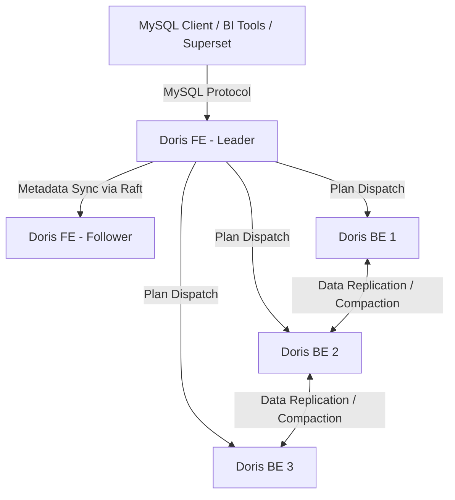
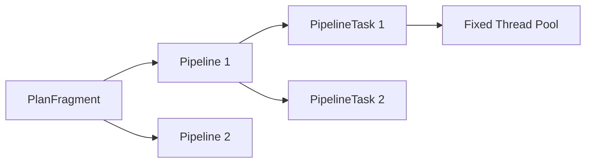
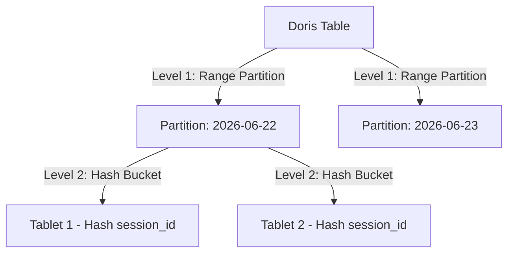
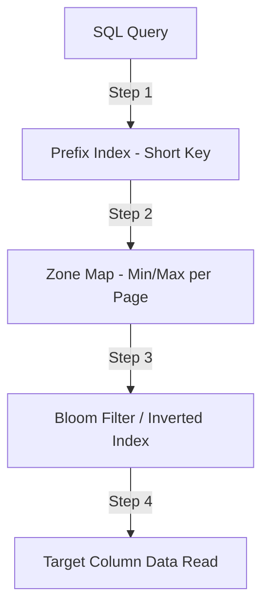

# CHƯƠNG 3: CÔNG NGHỆ LƯU TRỮ VÀ PHÂN TÍCH APACHE DORIS

## 3.1. Tổng quan về công nghệ Apache Doris

### 3.1.1. Giới thiệu chung
Apache Doris là một hệ quản trị cơ sở dữ liệu phân tích thời gian thực (Real-time Analytical Database) mã nguồn mở, được thiết kế theo kiến trúc xử lý song song quy mô lớn MPP (Massively Parallel Processing). Với khả năng hỗ trợ truy vấn phân tích tương tác (Interactive OLAP) trên các tập dữ liệu có quy mô từ hàng chục Terabyte đến Petabyte, Apache Doris đóng vai trò là tầng lưu trữ dữ liệu hoạt động ODS (Operational Data Store) thời gian thực trong các hệ thống xử lý dữ liệu lớn hiện đại. Hệ thống tích hợp trực tiếp khả năng nạp dữ liệu tốc độ cao (high-throughput ingestion) và công cụ thực thi tối ưu hóa để đảm bảo độ trễ truy vấn nằm trong ngưỡng dưới một giây (sub-second query latency).

### 3.1.2. Các đặc tính công nghệ cốt lõi
*   **Vectorized Execution Engine (Công cụ thực thi vector hóa)**: Apache Doris khai thác tối đa sức mạnh của tập lệnh xử lý SIMD (Single Instruction Multiple Data) trên các dòng vi xử lý hiện đại. Việc tính toán dữ liệu được thực hiện theo từng khối (chunk) thay vì xử lý đơn dòng, giúp giảm thiểu đáng kể chi phí gọi hàm và tăng tốc độ xử lý CPU.
*   **Vectorized Query Optimizer**: FE chuyển đổi SQL thành các cây logic (Logical Plan), sau đó tối ưu hóa dựa trên chi phí (CBO) và luật (RBO) để tạo ra các mảnh kế hoạch vật lý (`PlanFragment`) phân tán gửi tới các BE.
*   **Giao thức kết nối chuẩn**: Hệ thống tương thích hoàn toàn với giao thức MySQL, cho phép các công cụ trực quan hóa (BI) như Apache Superset, Tableau hay các thư viện kết nối chuẩn kết nối trực tiếp mà không cần cấu hình Driver tùy biến.
*   **Khả năng tự hồi phục và mở rộng (Elasticity & Resiliency)**: Doris hỗ trợ mở rộng tuyến tính khả năng tính toán và dung lượng lưu trữ bằng cách thêm mới các node FE hoặc BE vào cụm mà không gây gián đoạn dịch vụ nạp hay truy vấn dữ liệu.

---

## 3.2. Kiến trúc hệ thống phân tán của Apache Doris

Hệ thống Apache Doris được thiết kế theo kiến trúc tối giản, phân rã độc lập thành hai thành phần chính: Frontend (FE) và Backend (BE). Mô hình kiến trúc phân tán này loại bỏ hoàn toàn các phụ thuộc vào các hệ thống quản trị cụm bên thứ ba như Apache ZooKeeper.

### 3.2.1. Thành phần Frontend (FE)
FE đóng vai trò là hạt nhân điều phối toàn bộ cụm Doris. Các nhiệm vụ chính bao gồm quản lý kết nối từ người dùng, lưu trữ siêu dữ liệu (metadata), phân tích cú pháp câu lệnh SQL, tối ưu hóa truy vấn và lập kế hoạch thực thi phân tán.
*   **Cơ chế quản lý siêu dữ liệu (Metadata Consensus)**: Siêu dữ liệu của cụm (thông tin phân vùng, danh sách bảng, cấu hình BE) được lưu trữ trực tiếp trong bộ nhớ của FE và ghi nhận vào nhật ký ghi trước (Write-Ahead Log - bdbje). Cơ chế đồng thuận giữa các FE được duy trì thông qua thuật toán đồng thuận Raft sửa đổi.
*   **Phân rã vai trò các node FE**:
    *   *Leader*: Đóng vai trò là node điều phối chính, thực hiện ghi nhận các thay đổi siêu dữ liệu và đồng bộ tới các node khác. Chỉ có duy nhất một Leader hoạt động trong cụm.
    *   *Follower*: Tham gia vào quá trình bỏ phiếu bầu Leader và giữ bản sao đồng bộ của siêu dữ liệu. Khi Leader gặp sự cố, một Follower sẽ tự động được bầu chọn làm Leader mới.
    *   *Observer*: Chỉ đồng bộ siêu dữ liệu từ Leader với mục đích giảm tải truy vấn đọc siêu dữ liệu cho cụm FE, không tham gia vào quá trình bỏ phiếu bầu cử.

### 3.2.2. Thành phần Backend (BE)
BE đảm nhiệm vai trò lưu trữ dữ liệu vật lý và trực tiếp thực thi các phép tính toán truy vấn dưới sự điều phối của FE.
*   **Cơ chế thực thi**: Toàn bộ logic lưu trữ và xử lý tính toán của BE được viết bằng ngôn ngữ **C++** nhằm loại bỏ hoàn toàn cơ chế dọn rác (Garbage Collection Overhead) của Java, tối đa hóa hiệu suất CPU và quản lý bộ nhớ đệm hiệu quả.
*   **Tính sẵn sàng cao của dữ liệu**: BE tự động quản lý các bản sao (Replicas) của các phân đoạn dữ liệu vật lý. Hệ thống tự động phát hiện các node BE bị lỗi vật lý để lên lịch trình bản sao phục hồi (Self-Healing) trên các node BE còn hoạt động lành mạnh.

---

## 3.3. Cơ chế thực thi truy vấn Pipeline (Pipeline Execution Engine)

Kể từ các phiên bản Apache Doris hiện đại, công nghệ lập lịch truy vấn chuyển dịch hoàn toàn sang **Pipeline Execution Engine** để thay thế mô hình Volcano truyền thống.

### 3.3.1. Nguyên lý phân rã và lập lịch kế hoạch truy vấn
Mỗi truy vấn SQL sau khi được tối ưu hóa ở FE sẽ được chia thành các mảnh kế hoạch vật lý (`PlanFragment`). Dưới cơ chế thực thi Pipeline, các fragment này tiếp tục được phân tách thành một đồ thị có hướng không chu trình (DAG) cấu thành từ các toán tử Pipeline (`PipelineTask`).
*   Một **Pipeline** định nghĩa một chuỗi hoạt động liên tiếp không bị chặn bởi I/O (ví dụ: `OlapScanNode` $\rightarrow$ `Project` $\rightarrow$ `Filter`).
*   Một **PipelineTask** là thực thể đại diện cho việc xử lý một khối dữ liệu cụ thể (Data Chunk) đi qua luồng Pipeline đó.

### 3.3.2. Cơ chế Yield-based Scheduling
Cơ chế lập lịch này giải quyết triệt để bài toán thắt nút cổ chai tài nguyên do nổ luồng xử lý (Thread Explosion):
*   Hệ thống duy trì một Thread Pool có số lượng luồng giới hạn cứng (thường tương thích với số lượng nhân CPU vật lý của node BE).
*   Trong quá trình xử lý, nếu một `PipelineTask` gặp trạng thái bị chặn (chờ nạp khối dữ liệu tiếp theo từ đĩa hoặc chờ dữ liệu từ mạng trong phép toán Hash Join), toán tử sẽ thực hiện lệnh **Yield** (nhường quyền sử dụng luồng) và tạm thời đưa bản thân vào trạng thái chờ (Blocked Queue).
*   Thread của CPU ngay lập tức chuyển sang xử lý các `PipelineTask` sẵn sàng khác trong hàng đợi hoạt động (Ready Queue), tối đa hóa công suất làm việc hữu ích của CPU.

### 3.3.3. Cơ chế Local Shuffle
Để tối ưu hóa tính toán đa luồng trên một node BE đơn lẻ, cơ chế **Local Shuffle** được áp dụng giữa các ranh giới của các toán tử Pipeline. Local Shuffle thực hiện phân phối lại các dòng dữ liệu dựa trên giá trị băm (Hash Key) trực tiếp trong bộ nhớ đệm RAM giữa các luồng CPU hoạt động song song. Cơ chế này loại bỏ hiện tượng phân phối dữ liệu không đều (Data Skew) giữa các nhân CPU, ngăn chặn việc một luồng CPU bị quá tải làm chậm tiến độ chung của toàn bộ Fragment.

---

## 3.4. Mô hình tổ chức dữ liệu vật lý và Logic (Data Partitioning & Bucketing)

Apache Doris phân chia dữ liệu dựa trên mô hình phân cấp hai tầng cấu trúc: Phân vùng (Partitioning) và Phân cụm (Bucketing).

### 3.4.1. Phân vùng dữ liệu (Partitioning)
*   **Phân vùng Range**: Dữ liệu thường được phân vùng theo khoảng thời gian dựa trên các cột mốc thời gian như ngày (`event_date`, `created_at`).
*   **Phân vùng List**: Dữ liệu được phân chia theo danh mục danh sách cụ thể (ví dụ: mã quốc gia, mã vùng địa lý).
*   **Cơ chế loại bỏ phân vùng (Partition Pruning)**: Khi truy vấn SQL chứa điều kiện lọc theo khóa phân vùng, công cụ tối ưu hóa sẽ loại trừ hoàn toàn các phân vùng không khớp trước khi quét dữ liệu vật lý trên đĩa.
*   **Phân vùng động (Dynamic Partitioning)**: Doris hỗ trợ cấu hình tự động quản lý phân vùng thông qua các thuộc tính trong phần `PROPERTIES`. Công cụ của FE sẽ tự động thực hiện các tác vụ tạo mới phân vùng cho các ngày kế tiếp và thu hồi/xóa bỏ các phân vùng đã hết hạn (Cold Data TTL).

### 3.4.2. Phân cụm dữ liệu (Bucketing)
*   Dữ liệu trong một phân vùng bắt buộc phải được chia nhỏ hơn nữa thông qua kỹ thuật băm dữ liệu (Hash Bucketing).
*   Mỗi cụm băm của một phân vùng cấu thành nên một thực thể lưu trữ vật lý độc lập gọi là **Tablet**.
*   **Tablet** là đơn vị cơ sở cho việc lập lịch phân tán, nhân bản dự phòng (Replication) và thực hiện di chuyển dữ liệu (Migration) giữa các ổ đĩa vật lý của các BE trong cụm.

### 3.4.3. Cơ chế Colocate Join
Trong các truy vấn thực hiện liên kết (JOIN) giữa hai bảng dữ liệu lớn, Doris hỗ trợ tối ưu hóa thông qua cơ chế **Colocate Join**. Nếu hai bảng được khai báo nằm chung trong một `Colocate Group` và có cùng cấu trúc phân cụm (số lượng Buckets và cột khóa băm trùng khớp), Doris FE sẽ điều phối để các Tablet tương ứng của hai bảng được lưu trữ vật lý trên cùng một node BE. Phép toán JOIN sau đó sẽ được thực thi hoàn toàn cục bộ trên node BE đó (Local Join), loại bỏ 100% chi phí truyền tải dữ liệu qua hạ tầng mạng (Network Data Shuffle).

---

## 3.5. Các mô hình bảng dữ liệu (Storage Data Models)

Apache Doris tổ chức lưu trữ dữ liệu dựa trên ba mô hình bảng chính, được xác định tại thời điểm khởi tạo bảng để tối ưu hóa cho từng nghiệp vụ cụ thể.

### 3.5.1. Mô hình khóa trùng lặp (Duplicate Key Model)
*   **Đặc tính lưu trữ**: Lưu trữ nguyên vẹn cấu trúc dòng dữ liệu đầu vào. Chấp nhận các bản ghi có khóa trùng khớp hoàn toàn.
*   **Lĩnh vực ứng dụng**: Phù hợp cho việc lưu trữ nhật ký hệ thống (log), dữ liệu clickstream thô (như bảng `dwd_clickstream_events`).
*   **Đánh giá hiệu năng**: Cung cấp hiệu năng ghi dữ liệu (Write Throughput) cao nhất do không cần tốn chi phí đối chiếu khóa trùng lặp (De-duplication overhead) tại thời điểm nạp.

### 3.5.2. Mô hình khóa duy nhất (Unique Key Model)
*   **Đặc tính lưu trữ**: Hoạt động theo cơ chế cập nhật khóa (`UPSERT`). Nếu bản ghi mới nạp trùng khóa chính với bản ghi hiện có, bản ghi mới sẽ thay thế bản ghi cũ.
*   **Lĩnh vực ứng dụng**: Lưu trữ các dữ liệu có sự biến động trạng thái như thông tin tài khoản (`dim_users`), danh mục sản phẩm (`dim_products`) đồng bộ trực tiếp qua dòng dữ liệu CDC.
*   **Cơ chế đối chiếu**:
    1.  *Merge-on-Read (MoR - Gộp khi đọc)*: Dữ liệu mới được ghi trực tiếp vào các tệp vật lý mới. Khi có truy vấn đọc, Doris mới thực hiện gộp và loại bỏ các bản ghi cũ. Cơ chế này giúp tốc độ ghi nhanh nhưng tốc độ đọc bị suy giảm đáng kể dưới tải cao.
    2.  *Merge-on-Write (WoW - Gộp khi ghi)*: Được áp dụng từ Doris 2.0 trở đi. Khi một bản ghi mới được ghi vào, Doris sử dụng cấu trúc Primary Key Index để tìm kiếm vị trí khóa cũ và đánh dấu bản ghi cũ thuộc về file segment cũ là đã lỗi thời (Delete Bitmap). Khi thực hiện truy vấn đọc, Doris chỉ việc quét trực tiếp các bản ghi hợp lệ mà không cần qua bước gộp (merge) dữ liệu, nâng cao hiệu năng truy vấn lên gấp 3-10 lần so với cơ chế MoR.
*   **Cơ chế đánh dấu xóa (__DORIS_DELETE_SIGN__)**: Để xử lý tác vụ xóa (DELETE) truyền từ nguồn CDC nghiệp vụ, Doris sử dụng một cột ẩn kiểu logic là `__DORIS_DELETE_SIGN__`. Khi có yêu cầu xóa một bản ghi, hệ thống thực hiện append một dòng dữ liệu với khóa đó và đặt giá trị `__DORIS_DELETE_SIGN__ = 1`. Mọi câu truy vấn đọc sau đó sẽ tự động áp dụng bộ lọc ẩn loại trừ các dòng bị đánh dấu này, đảm bảo tính nhất quán dữ liệu thời gian thực.

### 3.5.3. Mô hình tích lũy dữ liệu (Aggregate Key Model)
*   **Đặc tính lưu trữ**: Dữ liệu có cùng khóa định danh sẽ được tự động tích lũy (Aggregate) theo hàm gộp định nghĩa sẵn (như `SUM`, `MIN`, `MAX`, `REPLACE`, hoặc `BITMAP_UNION` phục vụ tính toán UV) ngay tại thời điểm ghi nhận và trong quá trình chạy nén ngầm (Compaction).

---

## 3.6. Cơ chế tối ưu hóa truy vấn thông qua chỉ mục phụ (Secondary Indexing)

Bên cạnh cấu trúc chỉ mục chính, Apache Doris thiết lập hệ thống chỉ mục đa tầng để gia tốc tối đa các phép toán tìm kiếm dữ liệu.

### 3.6.1. Chỉ mục tiền tố (Prefix Index)
*   Dữ liệu trong các file segment của Doris luôn được sắp xếp vật lý theo thứ tự của các cột khóa chính (`KEY`).
*   Doris tự động trích xuất giá trị tiền tố (tối đa 36 bytes) của dòng dữ liệu đầu tiên từ mỗi khối dữ liệu gồm 1024 dòng để tạo ra một mục chỉ mục thưa (Sparse Index).
*   **Nguyên lý hoạt động**: Khi truy vấn có điều kiện lọc theo cột khóa chính, Doris dùng thuật toán tìm kiếm nhị phân trên chỉ mục tiền tố để xác định nhanh các khối dữ liệu mục tiêu cần quét, loại bỏ I/O đọc các khối không liên quan.

### 3.6.2. Chỉ mục đảo (Inverted Index)
*   Doris hỗ trợ cấu hình chỉ mục đảo dựa trên định dạng Lucene để thay thế cấu trúc Bitmap Index truyền thống.
*   **Nguyên lý hoạt động**: Chỉ mục đảo phân tách các từ khóa (Tokenization) hoặc lưu giữ giá trị của cột và tạo ra danh sách liên kết ngược trỏ trực tiếp đến các ID dòng vật lý (Row ID) chứa giá trị đó.
*   **Lợi ích**: Tăng tốc vượt trội cho các truy vấn lọc trên các cột không phải khóa chính, hỗ trợ các toán tử logic `=`, `!=`, `>`, `<`, `IN` và thực hiện tìm kiếm chuỗi văn bản nâng cao (`MATCH`).

### 3.6.3. Chỉ mục Bloom Filter
*   Chỉ mục xác suất Bloom Filter được tạo lập trên từng khối dữ liệu vật lý (Data Block) cho các cột được người dùng cấu hình cụ thể.
*   **Nguyên lý hoạt động**: Sử dụng các hàm băm để kiểm tra sự tồn tại của một giá trị. Nếu Bloom Filter thông báo giá trị **không tồn tại**, hệ thống chắc chắn 100% giá trị đó không nằm trong khối dữ liệu hiện tại và bỏ qua (skip) toàn bộ khối đó mà không cần đọc I/O đĩa.

### 3.6.4. Chỉ mục Zone Map
*   Doris tự động ghi nhận và lưu trữ các giá trị lớn nhất (MAX) và nhỏ nhất (MIN) của mỗi cột tương ứng với từng tệp tin Segment và từng trang dữ liệu vật lý (Data Page).
*   Giúp loại bỏ nhanh các phân đoạn dữ liệu trong các truy vấn lọc theo khoảng giá trị (Range Query).

---

## 3.7. Cấu trúc lưu trữ vật lý trên đĩa (Physical Storage Layout)

### 3.7.1. Định dạng lưu trữ hướng cột (Column-Oriented Storage)
*   Dữ liệu của bảng được ghi xuống đĩa dưới dạng các tệp tin `Segment`. Dữ liệu của từng cột được phân tách vật lý thành các khối dữ liệu riêng biệt.
*   **Thuật toán nén dữ liệu**: Nhờ tính chất đồng nhất kiểu dữ liệu của định dạng cột, Doris áp dụng các thuật toán nén hiện đại như **LZ4** (ưu tiên tốc độ giải nén) hoặc **ZSTD** (ưu tiên tỷ lệ nén sâu) giúp giảm dung lượng lưu trữ thực tế xuống từ 3 đến 5 lần so với lưu trữ dạng dòng truyền thống.

### 3.7.2. Phân tách siêu dữ liệu Segment V3 (Segment Metadata Separation)
*   Trong cấu trúc file segment truyền thống, thông tin siêu dữ liệu mô tả cấu trúc cột thường được ghi chung ở phần cuối trang (Footer). Khi mở file segment, hệ thống phải load toàn bộ footer này vào RAM.
*   Với cấu trúc **Segment V3**, phần siêu dữ liệu của từng cột được tách biệt hoàn toàn vật lý khỏi footer của file segment.
*   **Lợi ích**: Tiết kiệm đáng kể dung lượng bộ nhớ RAM của node BE và tăng tốc thời gian mở các file segment dữ liệu, đặc biệt tối ưu cho các bảng có hàng trăm cột (wide tables).

### 3.7.3. Mô hình lưu trữ hỗn hợp dòng-cột (Hybrid Row-Columnar Storage)
*   Apache Doris cho phép người dùng cấu hình lưu trữ song song một bản sao dạng dòng (Row Store) của bản ghi bên cạnh định dạng cột mặc định.
*   **Lợi ích**: Đối với các ứng dụng thực hiện các truy vấn điểm (Point Lookup) hoặc truy vấn chi tiết thực thể bằng khóa chính (`SELECT * WHERE id = ?`), Doris sẽ chuyển hướng đọc trực tiếp từ tệp lưu trữ dòng, loại bỏ hoàn toàn chi phí ghép cột ngẫu nhiên (Random multi-column stitching) của cơ chế hướng cột thông thường, mang lại hiệu năng truy vấn điểm tương đương với các hệ cơ sở dữ liệu OLTP truyền thống.